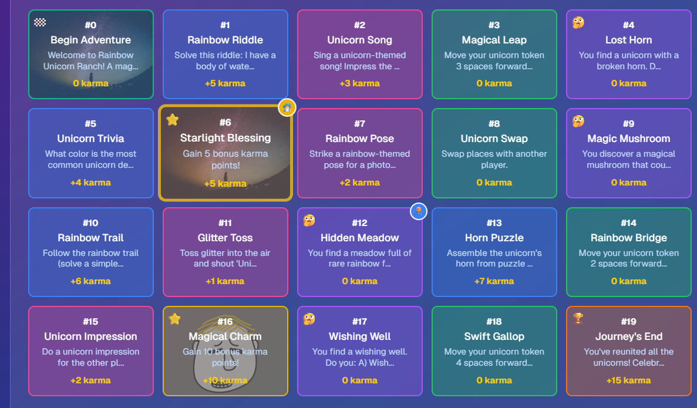

# 🎲 Storyforge

Storyforge is an interactive multiplayer board game that combines traditional board game mechanics with dynamic storytelling. Players take turns rolling dice, moving across the board, and experiencing unique story events that unfold based on their choices and landing spots.

## ✨ Features

- **Dual Play Modes**: Play locally on one device or online with friends
- **Real-time Multiplayer**: Connect and play with friends using Supabase real-time database
- **Dynamic Storytelling**: AI-generated story events based on game progress
- **Interactive Game Board**: Visual board with animated player movements and dice rolls
- **Custom Themes**: Various game themes that influence the storytelling
- **Persistent Game State**: Save and resume games

## 🚀 Getting Started

### Prerequisites

- Node.js 18+ and npm/yarn
- Supabase account (for online multiplayer)

### Installation

1. Clone the repository:
   \`\`\`bash
   git clone https://github.com/yourusername/storyforge.git
   cd storyforge
   \`\`\`

2. Install dependencies:
   \`\`\`bash
   npm install
   # or
   yarn install
   \`\`\`

3. Set up environment variables:
   Create a `.env.local` file in the root directory with the following variables:
   \`\`\`
   NEXT_PUBLIC_SUPABASE_URL=your_supabase_url
   NEXT_PUBLIC_SUPABASE_ANON_KEY=your_supabase_anon_key
   GEMINI_API_KEY=your_gemini_api_key (optional for AI storytelling)
   \`\`\`

4. Set up the database:
   Run the SQL scripts in the `scripts` folder against your Supabase database:
   - `create-tables.sql` or `create-tables-v2.sql` (latest version)
   - `setup-database.sql`

5. Start the development server:
   \`\`\`bash
   npm run dev
   # or
   yarn dev
   \`\`\`

6. Open [http://localhost:3000](http://localhost:3000) in your browser.

## 🎮 How to Play

### Local Mode

1. Navigate to `/local` to start a local game
2. Set up players and game settings in the lobby
3. Start the game and take turns rolling dice and moving
4. Experience story events as you land on special tiles
5. The first player to reach the end wins!

### Online Multiplayer

1. Navigate to the home page and select "Play Online"
2. Create a new game or join an existing one with a game code
3. Share the game code with friends to join your game
4. Wait for all players to join in the lobby
5. Start the game and enjoy real-time multiplayer action!

## 🔄 Connection Management

Storyforge uses a hybrid approach for real-time updates:
- Primary: Supabase real-time subscriptions
- Fallback: Polling at 1-second intervals if real-time connection fails
- Connection status indicator shows current connection method
- Manual refresh button available if state gets stuck

## 🛠️ Technologies

- **Next.js**: React framework for the frontend
- **TypeScript**: Type-safe JavaScript
- **Tailwind CSS**: Utility-first CSS framework
- **Supabase**: Backend as a service for database and real-time functionality
- **Gemini API**: AI for dynamic story generation (optional)

## 🧩 Project Structure

\`\`\`
storyforge/
├── app/                  # Next.js app router pages
│   ├── game/             # Online multiplayer game routes
│   ├── local/            # Local multiplayer game routes
│   └── ...
├── components/           # React components
├── hooks/                # Custom React hooks
│   ├── use-game.ts       # Game state management hook
│   ├── use-game-local.ts # Local game logic
│   └── use-game-supabase.ts # Online game logic
├── lib/                  # Utility functions and game logic
├── public/               # Static assets
└── scripts/              # Database setup scripts
\`\`\`

## 🤝 Contributing

Contributions are welcome! Please feel free to submit a Pull Request.

1. Fork the repository
2. Create your feature branch (`git checkout -b feature/amazing-feature`)
3. Commit your changes (`git commit -m 'Add some amazing feature'`)
4. Push to the branch (`git push origin feature/amazing-feature`)
5. Open a Pull Request

## 📝 License

This project is licensed under the MIT License - see the LICENSE file for details.

## 🙏 Acknowledgements

- Next.js team for the amazing framework
- Supabase for the real-time database capabilities
- All contributors who have helped shape this project
