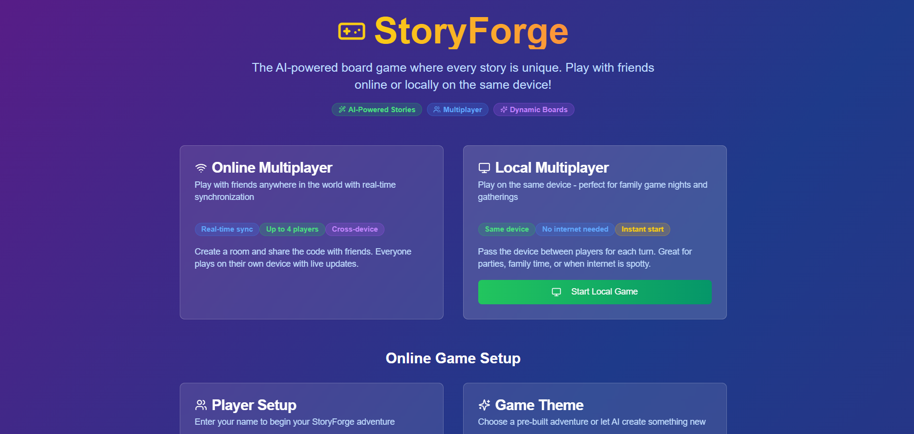

# 🎲 Storyforge

Storyforge is an interactive multiplayer board game that combines traditional board game mechanics with dynamic storytelling. Players take turns rolling dice, moving across the board, and experiencing unique story events that unfold based on their choices and landing spots.

## ✨ Features

- **Dual Play Modes**: Play locally on one device or online with friends
- **Real-time Multiplayer**: Connect and play with friends using Supabase real-time database
- **Dynamic Storytelling**: AI-generated story events based on game progress
- **Interactive Game Board**: Visual board with animated player movements and dice rolls
- **Custom Themes**: Various game themes that influence the storytelling
- **Persistent Game State**: Save and resume games

## 🎮 How to Play

### Local Mode

1. Navigate to `/local` to start a local game
2. Set up players and game settings in the lobby
3. Start the game and take turns rolling dice and moving
4. Experience story events as you land on special tiles
5. The first player to reach the end wins!

### Online Multiplayer

1. Navigate to the home page and select "Play Online"
2. Create a new game or join an existing one with a game code
3. Share the game code with friends to join your game
4. Wait for all players to join in the lobby
5. Start the game and enjoy real-time multiplayer action!

## 🔄 Connection Management

Storyforge uses a hybrid approach for real-time updates:
- Primary: Supabase real-time subscriptions
- Fallback: Polling at 1-second intervals if real-time connection fails
- Connection status indicator shows current connection method
- Manual refresh button available if state gets stuck

## 🛠️ Technologies

- **Next.js**: React framework for the frontend
- **TypeScript**: Type-safe JavaScript
- **Tailwind CSS**: Utility-first CSS framework
- **Supabase**: Backend as a service for database and real-time functionality
- **Gemini API**: AI for dynamic story generation (optional)

## 📝 License

This project is licensed under the MIT License - see the LICENSE file for details.

## 🙏 Acknowledgements

- Next.js team for the amazing framework
- Supabase for the real-time database capabilities
